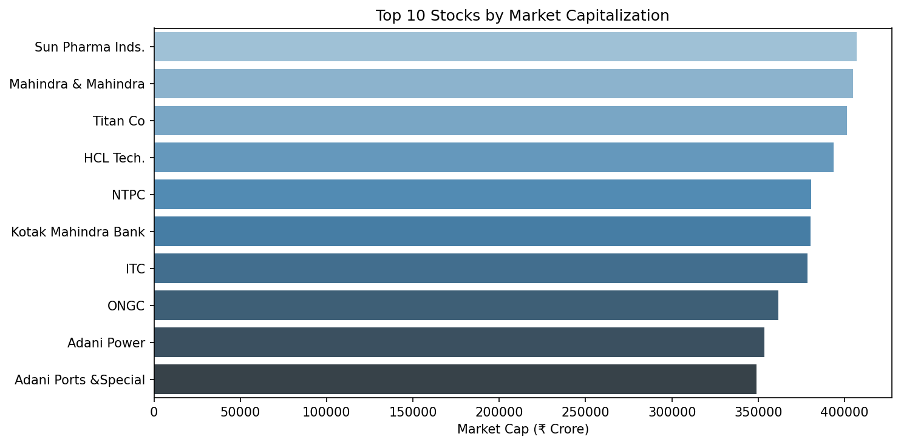
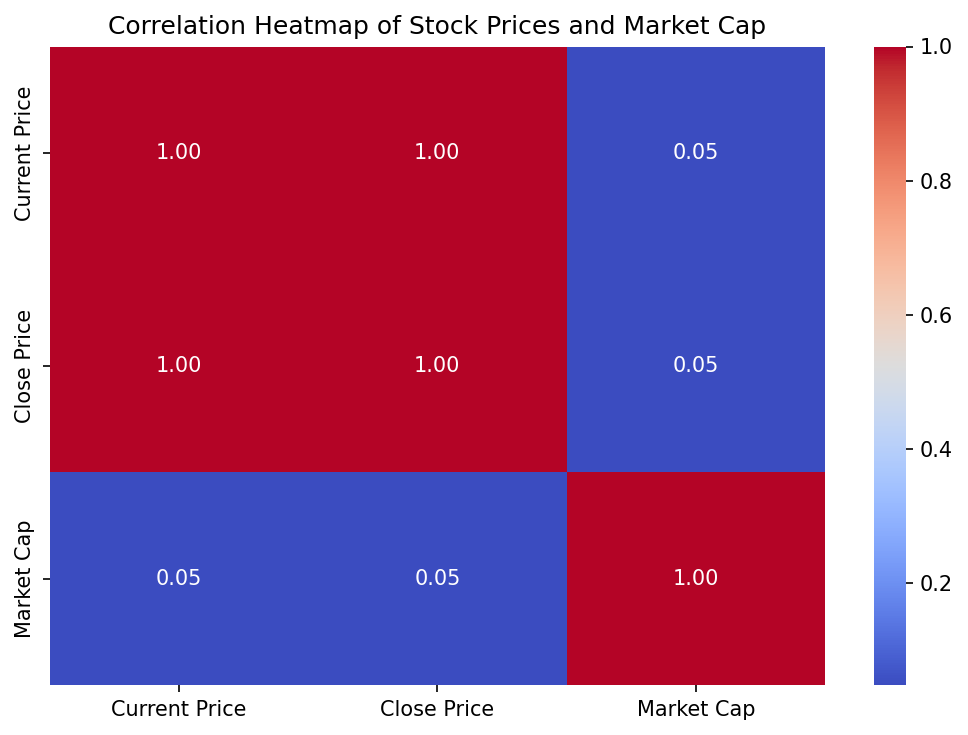

# Stock Market Data Analysis using Web Scraping

## Overview
Scraped real-time stock data from Groww (India's stock platform) using
Python and Selenium. Performed end-to-end EDA and statistical analysis
on 500+ stocks.

## Tools Used
Python, Selenium, Pandas, Matplotlib, Seaborn, SciPy

## Key Findings
- Market cap is right-skewed; top 10 companies dominate
- Strong correlation between Current Price and Close Price (r > 0.99)
- One-way ANOVA confirms Groww lists Large Cap stocks on page 1 (p < 0.05)
- Most stocks (~60%) fall in the Small Cap category

## Project Structure
├── .ipynb   # Main notebook
├── groww_stocks_data.csv  # Scraped dataset
├── images/                # All chart outputs
│   ├── top10_market_cap.png
│   ├── correlation_heatmap.png
│   ├── market_cap_distribution.png
│   ├── cap_category.png
│   └── daily_change_distribution.png
└── README.md

## Charts Preview

